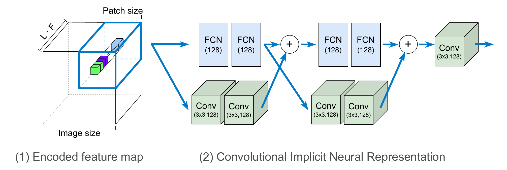
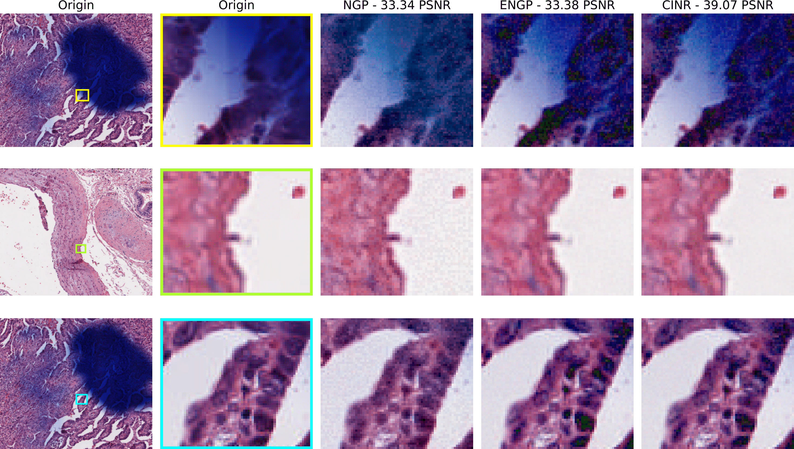

# CINR
# CINR Convolutional Implicit Neural Representation of pathology whole-slide images
DongEon Lee, Chunsu Park, SeonYeong Lee, SiYeoul Lee, MinWoo Kim
| [Project Page](https://pnu-amilab.github.io/CINR/) 
| [Paper]()
| [Project Page](https://github.com/pnu-amilab/CINR) 

# Overview

# Abstract. 
This study explored the application of implicit neural representations (INRs) to enhance digital histopathological imaging. Traditional imaging methods rely on discretizing the image space into grids, managed through a pyramid file structure to accommodate the large size of whole slide images (WSIs); however, the continuous mapping capability of INRs, utilizing a multi-layer perceptron (MLP) to encode images directly from coordinates, presents a transformative approach.
This method promises to streamline WSI management by eliminating the need for down-sampled versions, allowing instantaneous access to any image region at the desired magnification, thereby optimizing memory usage and reducing data storage requirements. Despite their potential, INRs face challenges in accurately representing high spatial frequency components that are pivotal in histopathology. To address this gap, we introduce a novel INR framework that integrates auxiliary convolutional neural networks (CNN) with a standard MLP model. This dual-network approach not only facilitates pixel-level analysis, but also enhances the representation of local spatial variations, which is crucial for accurately rendering the complex patterns found in WSIs. Our experimental findings indicated a substantial improvement in the fidelity of histopathological image representation, as evidenced by a 3-6 dB increase in the peak signal-to-noise ratio compared to existing methods. This advancement underscores the potential of INRs to revolutionize digital histopathology, offering a pathway towards more efficient diagnostic imaging techniques.

# Result

